# Introducción {data-background-image="imagenes/fondo.png"}
<!-- por acá empieza Vero la resentación -->
"Generación de Segmentos Geográficos en áreas urbanas y suburbanas"

## ¿Que es la segmentación?

Son las tareas que permiten subdividir el radio censal en segmentos.

Para asegurar que todas las viviendas sean censadas, hay que determinar qué área y qué viviendas le corresponden a cada censista.

## Tareas: Generar mapas, recorridos, planillas. {.unlisted .unnumbered}

-   16 millones de domicilios.
-   De 8 a 12 hs. de trabajo.
-   Carga promedio en zona urbana: entre 30 y 36 viviendas (según la provincia)
-   Carga promedio en asentamientos: 18 viviendas.
-   Carga promedio en zona suburbana: 12 a 15 viviendas.
-   Aprox. 650 mil censistas

## Descripción del problema.

-   Armar el recorrido de 650.000 censistas para que visiten todas las viviendas del territorio siguiendo las reglas definidas en el MANUAL del SEGMENTADOR.

## El problema

Un problema de optimización, matemáticamente se formula como: Minimizar $f(x)$ sujeto a: $x \in S$, donde $S$ es el conjunto de los valores entre los que podemos buscar la solución, lo que se llama conjunto de soluciones factibles.

En este caso, $S$ es el conjunto de todas las segmentaciones posibles, $x$ es una segmentación y $f(x)$ es el costo de dicha segmentación.

## Función objetivo con costo que incluye penalidad

-   Cantidad de viviendas por segmento
-   Cantidad de manzanas por segmento
-   Tipos de ejes que se cruzan

## Delimitación del segmento

-   Todo espacio (con o sin viviendas) debe estar asignado a un segmento.
-   Identificar claramente Inicio y Fin de cada segmento.

## Facilitar el recorrido del censista

## Evitar

-   Recorrido discontinuo
-   Cruce en diagonal
-   "En lo posible" cruce de avenidas, rutas, vías de ferrocarril o cursos de agua.

## Segmentos

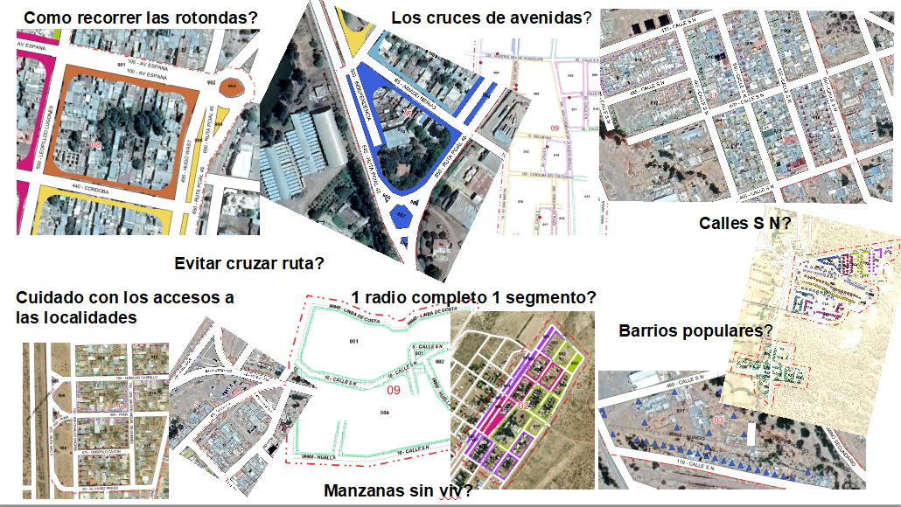{width="90%"}

# Tipos de Radios

-   Urbano:

    población agrupada únicamente

-   Suburbano:

    población agrupada en pequeños poblados o en bordes amanzanados

::: notes
**Urbano:** población agrupada únicamente, y conformado por manzanas y/o sectores pertenecientes a una localidad.

**Suburbano:** agrupada en pequeños poblados o en bordes amanzanados de localidades.
:::

## Radios Urbanos o parte Urbana de Radios Mixtos

## Según distribución de viviendas dada una carga deseada.

-   Esparcidos: todos los lados con pocas viviendas.
-   Densos: todas las manzanas con muchas viviendas.
-   Combinados: situaciones intermedias, algunas manzanas con pocas viviendas o algunos lados con muchas viviendas.

# Generación de segmentaciones vecinas

------------------------------------------------------------------------

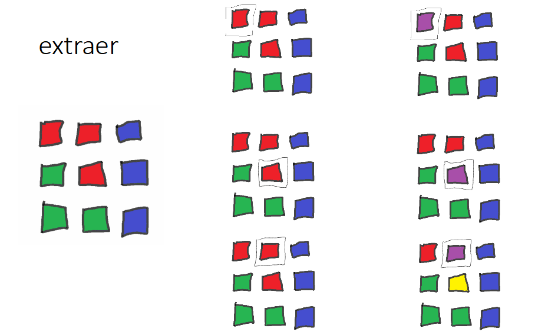{width="90%"}

------------------------------------------------------------------------

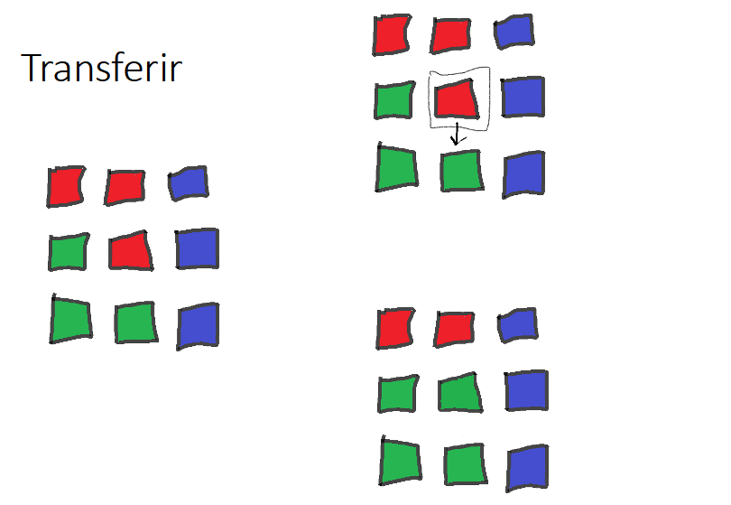{width="90%"}

------------------------------------------------------------------------

{width="90%"}

# Optimización global

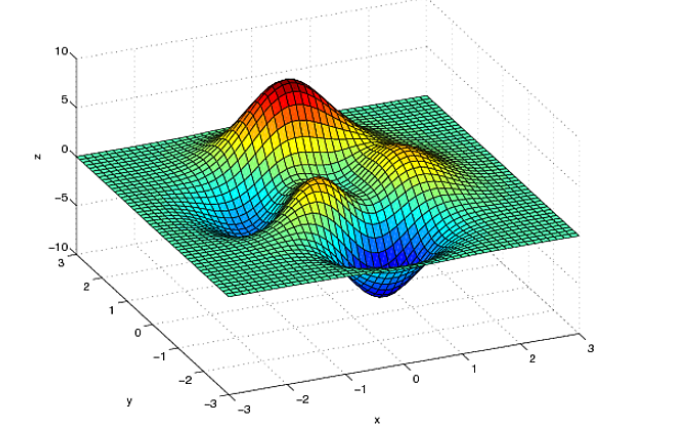{width="90%"}

## Espacio factible definido por vecindario de segmentación

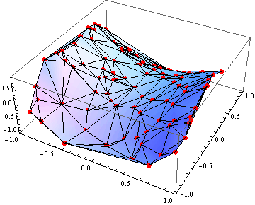{width="75%"}

## Vecinos se calculan con operaciones elementales

1.  Extraer componente (manzana o lado) de segmento

2.  Transferir componente de un segmento a otro

3.  Fusionar 2 segmentos

# Algoritmos

## Algoritmo para radios esparcidos (lados completos)

1.  Tomar una segmentación inicial y hacer que sea la actual
2.  Calcular todas las segmentaciones vecinas a la actual y elejir una de costo mínimo
3.  Si su costo es menor que el costo de la segmentación actual, hacer ésta la nueva segmentación actual e iterar
4.  Si no, la segmentación actual es un mínimo local, terminar.

## Algoritmo para radios densos (manzanas independientes)

1.  En cada manzana encontrar el número entero $d_m$ más cercano a cantidad de viviendas de la manzana dividido por la cantidad de viviendas deseada
2.  Hacer ese, el número de segmentos en la manzana $m$
3.  Calcular la cantidad de viviendas por segmento en la manzana $m$, $s_m = v_m / d_m$
4.  Segmentar el listado de la manzana $m$ cortando a pisos enteros, avanzando con segmentos de cantidad de viviendas lo más cercano a $s_m$ posible

## Algoritmo para radios combinados

1.  Aplicar el algoritmo para radios esparcidos (lados completos)
2.  Para todos los segmentos que superen un valor umbral de viviendas aplicar algoritmo de (listado) manzana independiente
3.  Juntar segmentos con cero o pocas viviendas

# Numeración de los segmentos

-   Cada segmento del radio urbano se identifica con un número de dos dígitos, de 01 en más, dentro del radio.
-   En el área urbana del radio mixto los segmentos se numeran del 60 en más excluyendo al 90.
-   El segmento 90 contiene las viviendas colectivas del radio.

# Carga de datos y procesamiento de datos.

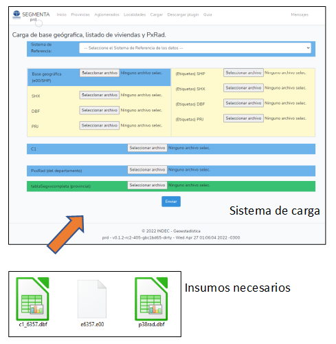{height="70%"}

---

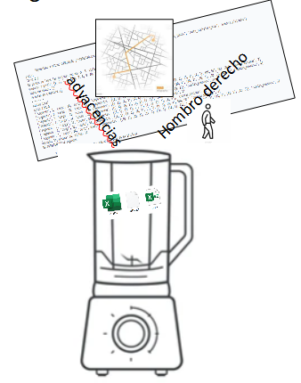{height="90%"}

# Elementos disponibles, o agrupación elemental.

-   Conteos: lados o manzanas completas
-   Listados: direcciones, pisos (no puede haber más de 1 segmento por piso) recorridos o manzanas independientes
-   Varias combinaciones de ambos.

# Software utilizado

{width="90%"}

## Segmentación.

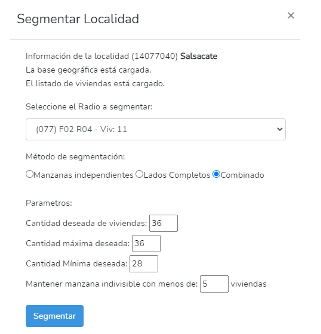{width="90%"}

# Generación de resumenes.

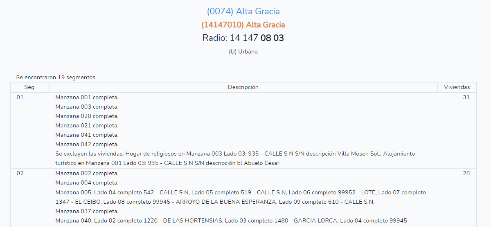{width="90%"}

## Estructura de Base de Datos

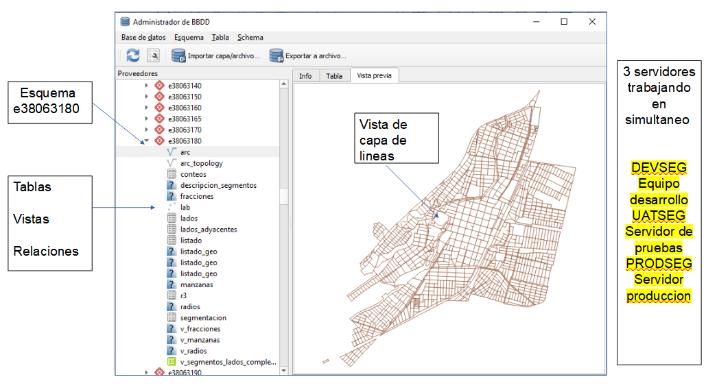{width="90%"}

# Tipos de radios

## Radios Urbanos

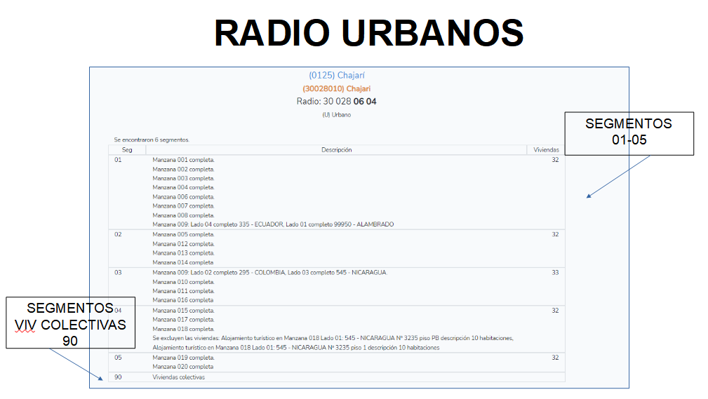{width="90%"}

## Radios Suburbanos

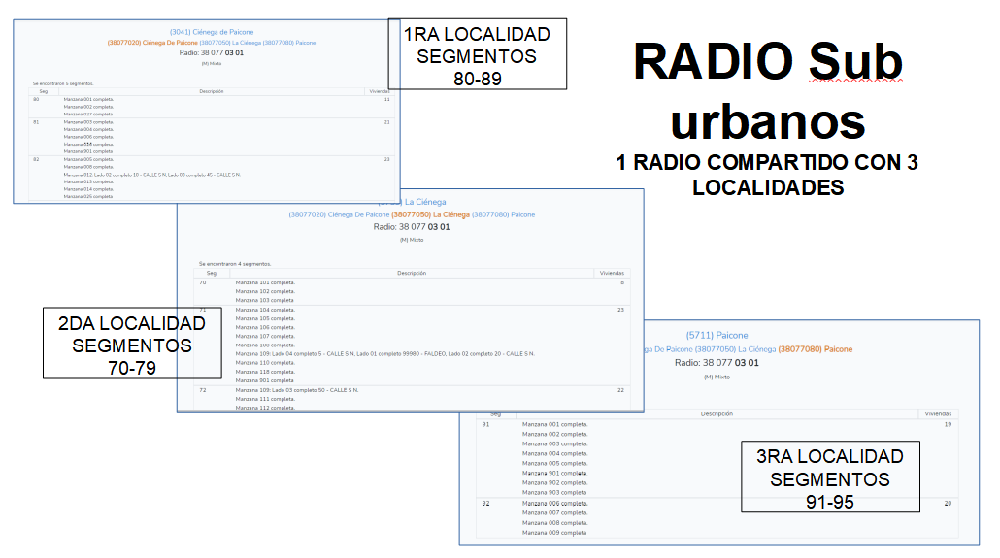{width="90%"}

## Segmentación de 1 Radio que compartido con 5 localidades

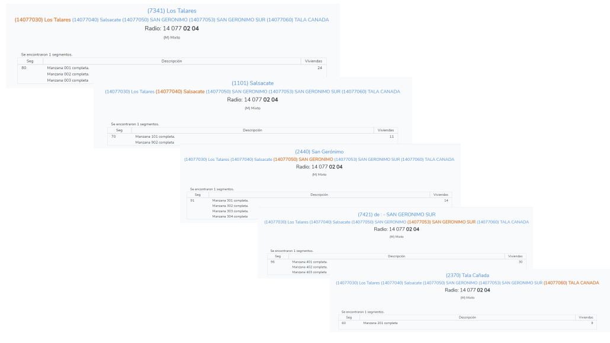{width="90%"}

# Resumen de la segmentación

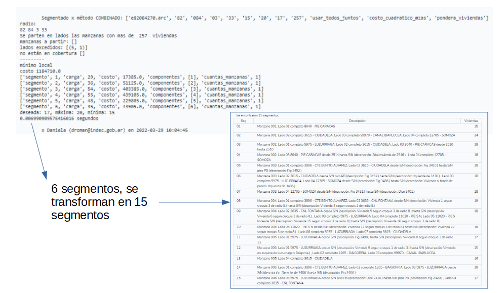{width="90%"}

## Previsualización de la segmentación y de grafo

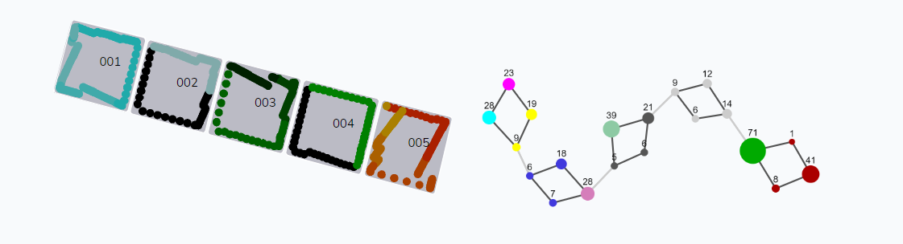{width="90%"}

# Salidas Gráficas.

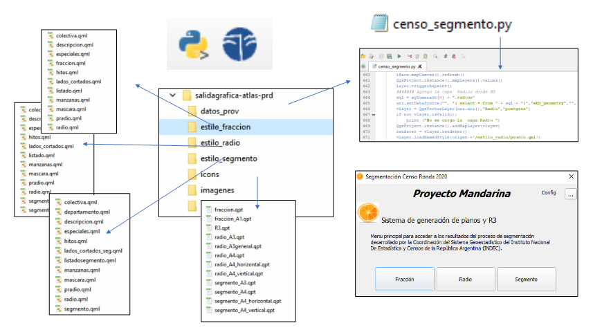{width="100%"}

## Espacio de trabajo QGIS

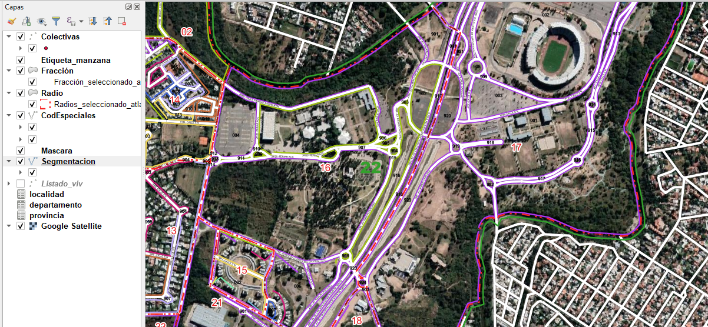{width="100%"}

## Mapas de Fracción

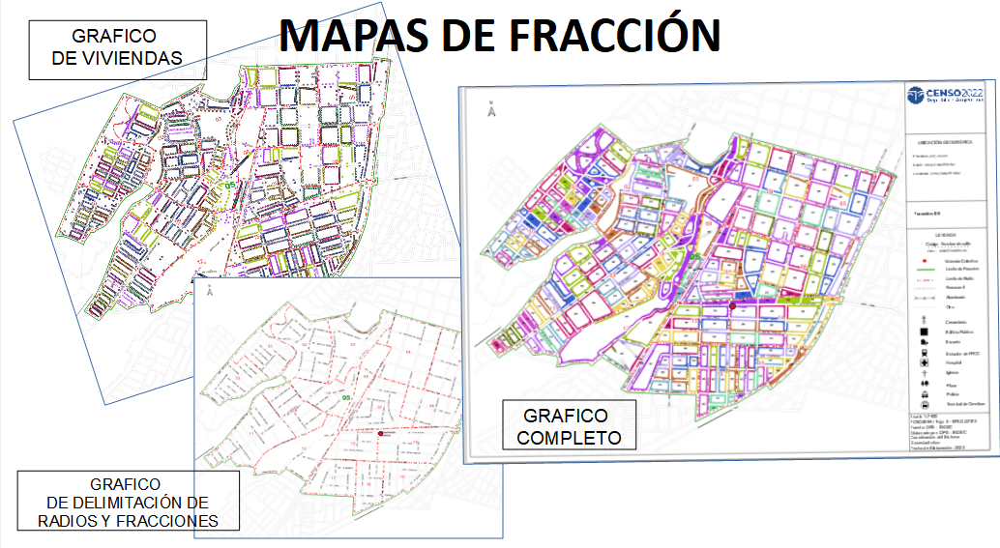{width="100%"}

## Mapas de Radio

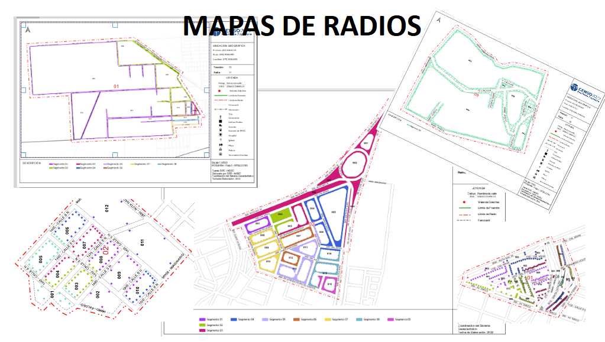{width="100%"}

## Mapas de Segmento

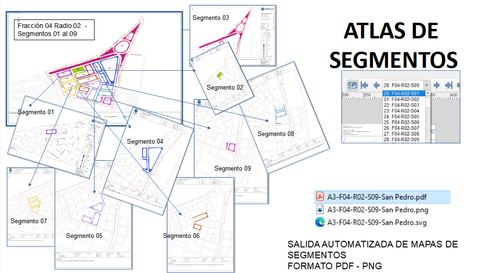{width="100%"}
# Conclusiones.

-   Pudimos resolver un problema complicado con algoritmos sencillos
-   Creamos una interface para la carga de datos y procesamiento de la segmentación
-   Creamos un plugin para la automatización de salidas gráficas y recorridos
-   Optimizamos tiempo y recursos para el armado de material de campo

## Optmización de recursos

-   Se redujo el tiempo de armado e impresión de mapas
-   Se utilizó el complemento atlas para automatizar el armado de los mapas para censistas, jefes de radio, fracción, departamento y la planilla R3 de recorrido del censista
-   Se informatizó y masificó la distribución de planos utilizando formato digital (.pdf .png)
-   Se fomentó el uso de herramientas de software libre, QGIS

# Gracias.

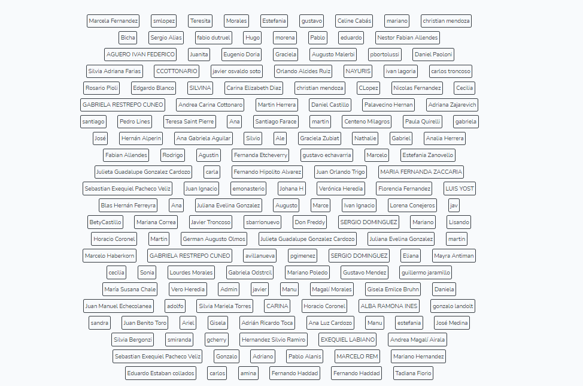{width="100%"}

## Preguntas {data-background-image="imagenes/fondo.png"}

### ?

## Contacto {data-background-gradient="linear-gradient(to bottom, #283b95, #17b2c3)"}

Hernán [halperin\@indec.gob.ar](mailto:halperin@indec.gob.ar){.email}

Verónica [vheredia\@indec.gob.ar](mailto:vheredia@indec.gob.ar){.email}

Manuel @cyberoliverio
