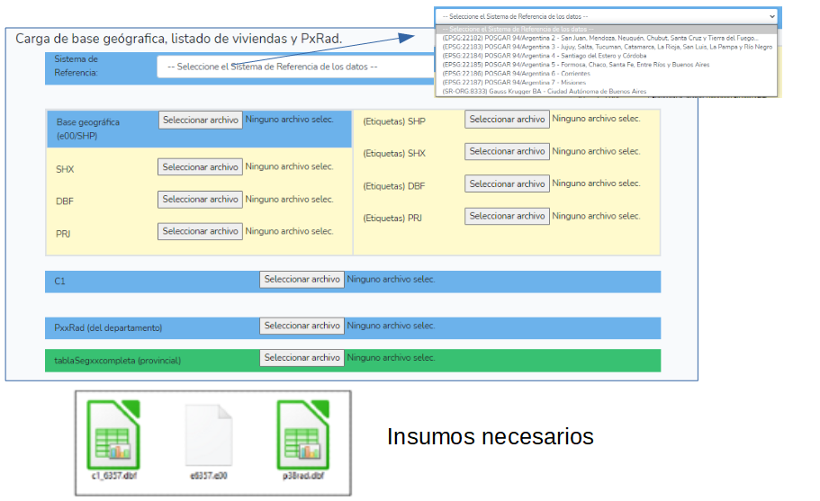

class: center, inverse 
background-image: url("plantilla_idera_html/img0.png")

# Introducción al problema.

## ¿Que es la segmentación?

Es la tarea que permite subdividir el radio censal en segmentos. 

Para asegurar que todas las viviendas sean censadas, hay que determinar qué área y qué viviendas le corresponden a cada censista.

------------------------------------------------------------------------

## Descripción somera: Generar mapas, recorridos, planillas.

-   16 millones de domicilios.
-   Carga promedio en zona urbana: entre 30 y 36 viviendas (según la provincia)
-   Carga promedio en asentamientos: 18 viviendas.
-   Carga promedio en zona suburbana: 12 a 15 viviendas.
-   De 8 a 12 hs. de trabajo.
-   Aprox. 650 mil censistas

------------------------------------------------------------------------

## Tipos de Radios

-   Urbano

--- población agrupada únicamente, y conformado por manzanas y/o sectores pertenecientes a una localidad. ---

-   Suburbano

--- agrupada en pequeños poblados o en bordes amanzanados de localidades. ---

------------------------------------------------------------------------

## Delimitación del segmento

-   Todo espacio (con o sin viviendas) debe estar asignado a un segmento.
-   Identificar claramente Inicio y Fin de cada segmento.

------------------------------------------------------------------------

### Facilitar el recorrido del censista

### Evitar

-   Recorrido discontinuo
-   Cruce en diagonal
-   "En lo posible" cruce de avenidas, rutas, vías de ferrocarril o cursos de agua.

------------------------------------------------------------------------

# Segmentos

------------------------------------------------------------------------

### Tipos de Radios Urbanos o parte Urbana de Radios Mixtos

#### Según distribución de viviendas dada una carga deseada.

-   Esparcidos: todos los lados con pocas viviendas.
-   Densos: todas las manzanas con muchas viviendas.
-   Combinados: situaciones intermedias, algunas manzanas con pocas viviendas o algunos lados con muchas viviendas.

------------------------------------------------------------------------

#### Elementos disponibles, o agrupación elemental.

-   Conteos: lados o manzanas completas
-   Listados: direcciones, pisos (no puede haber más de 1 segmento por piso) recorridos o manzanas independientes
-   Varias combinaciones de ambos.

------------------------------------------------------------------------

### Algoritmos o Métodos.

------------------------------------------------------------------------

# Optimización global

------------------------------------------------------------------------
# Como generara segmentaciones vecinas

------------------------------------------------------------------------

------------------------------------------------------------------------

------------------------------------------------------------------------

### Numeración de los segmentos

-   Cada segmento del radio urbano se identifica con un número de dos dígitos, de 01 en más, dentro del radio.
-   En el área urbana del radio mixto los segmentos se numeran del 60 en más excluyendo al 90.
-   El segmento 90 contiene las viviendas colectivas del radio.

------------------------------------------------------------------------

## Descripción del problema.

-   Armar el recorrido de 650.000 censistas para que visiten todas las viviendas del territorio siguiendo las reglas definidas en el MANUAL del SEGMENTADOR.

-------------------------------------------------------------------------

### El problema

Un problema de optimización, matemáticamente se formulan como:  \( Min f(x)
 sujeto a: x E S \) , donde S es el conjunto de los valores entre los que podemos buscar la solución, lo que se llama conjunto de soluciones factibles. 

En este caso, $ S $ es el conjunto de todas las segmentaciones posibles, $ x $
es una segmentación y $ f(x) $ es el costo de dicha segmentación.

------------------------------------------------------------------------

### Optimización Discreta

------------------------------------------------------------------------

### Función objetivo con costo que incluye penalidad

-   cantidad de viviendas por segmento
-   cantidad de manzanas por segmento
-   cantidad de segmentos
-   cantidad de lados delimitando segmentos

------------------------------------------------------------------------

#### Espacio factible definido por vecindario de segmentación

::: columns
::: {.column width="50%"}

:::

::: {.column width="50%"}
-   Vecinos se calculan con operaciones elementales 

1.  extraer componente (manzana o lado) de segmento
2.  transferir componente de un segmento a otro
3.  fusionar 2 segmentos
:::
:::

------------------------------------------------------------------------

# Carga de datos y procesamiento de datos.

## 

------------------------------------------------------------------------

------------------------------------------------------------------------

# Segmentación.

------------------------------------------------------------------------

# Generación de resumenes.

------------------------------------------------------------------------

# Salidas Gráficas.

------------------------------------------------------------------------

# Conclusiones.
